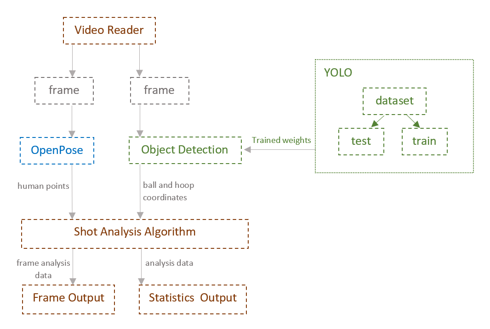
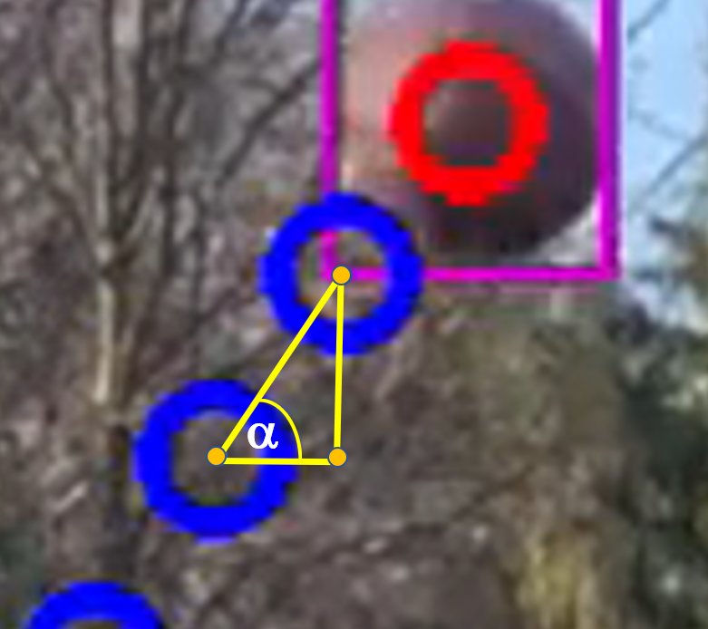
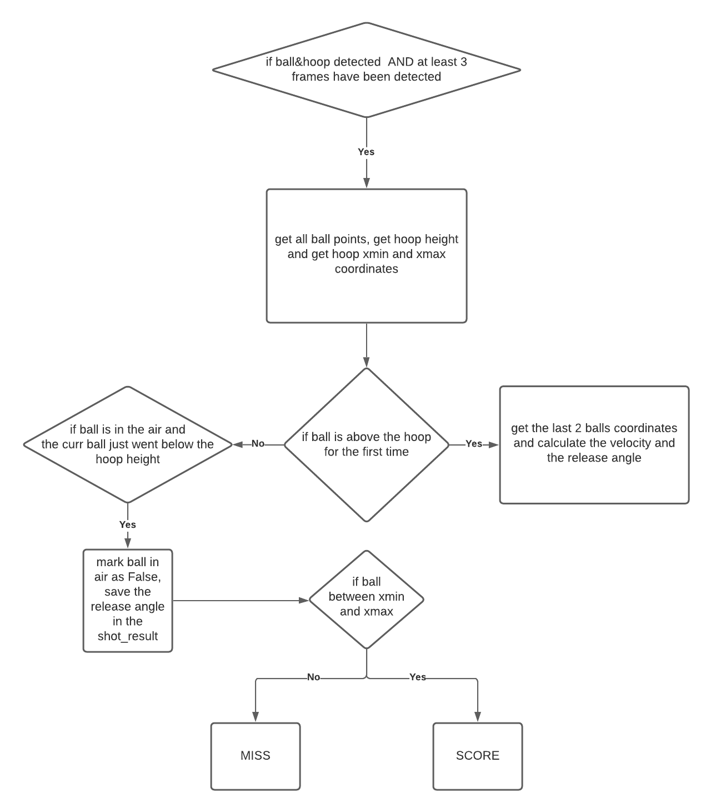
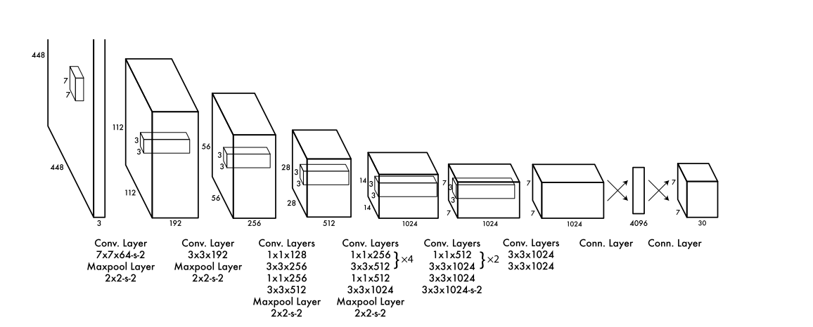

# Basketball Video Analysis using Computer Vision

Developed by Magdalena Fijalkowska in 2020/2021 as part of my Bachelor Hons project at the University of Liverpool, UK. 


## Overview of the project
The purpose of this project was to create a system that uses computer vision and open-source technologies to analyse the data captured from a single static camera in real-time during an individual shooter’s training.

It builds on the concept of object detection, object tracking and pose estimation in order to recognize when the shot is made and investigate the pose and shot characteristics to provide statistics such as:
* total number of shots taken
* missed shots
* made shots
* shot release angles etc.

### DEMO


Exemplary statistics that we might get after the video is processed:
```
Total shots attempts :  30
Made shots :  10
Missed shots :  20
Elbow Angle (made shots) :  54.6
Elbow Angle (missed shots) :  67.3
Knee Angle (made shots) :  138.21
Knee Angle (missed shots) :  140.0
Release angle (made shots) :  60.96
Release angle (missed shots) :  30.45
Average release speed :  10m/s
```

## Getting started

### Dependencies
In order to be able to run the software you need to install:

* Python3
* numpy 
* openCV 

#### 1. To run the software on your machine simply clone this repository by running this command:

``` git
$ git clone https://github.com/mfijalkowska/Final-Year-Project
```
#### 2. Go to the project directory and place all your training video files there (e.g. training.mp4)

#### 3. Run the following command: 
``` git
python main.py training.mp4
```
The program will start analysing the video.
Please note that the software is designed to run on a GPU with a proper CUDA setup, however, it can be run using only CPU.

## Features
### Generic Pipeline

### Release Angle Calculation
|  | 
|:--:| 
| *Figure 1:* Release Angle Calculation |

To calculate the release angle we take the last 2 frames when the ball was below the height of the basketball hoop and we calculate the angle between their center coordinates and the right angle. 

### SCORE/MISS algorithm

|  | 
|:--:| 
| *Figure 2:* Scoring Algorithm flowchart |
## Detector
|  | 
|:--:| 
| *Figure 3:* YOLOv1 model architecture[3] |


The object detection model is trained with YOLOv4[1] CNN model architecture, which includes pretrained weights on COCO dataset. 
The detector was trained with custom configuration parameters:

* batch = 64
* subdivisions = 16
* width = 416 (has to be a multiple of 32)
* height = 416 (32 multiple)
* max_batches = 6000
* steps = 4800, 5400 (80% of max_batches, 90% of max_batches) 
* classes = 2 (ball, hoop)
* filters = 21 ( (#classes + 5)*3 )
* random = 0 (to avoid memory issues - no image resizing)

Using the configuration described above the model was trained on a custom dataset.

## Pose Estimation

All the data for the shooting pose analysis is calculated by implementing OpenCV DNN using OpenPose MobileNet provided by [quanhua92/human-pose-estimation-opencv](https://github.com/quanhua92/human-pose-estimation-opencv) and open-sourced under [Apache 2.0 License](https://github.com/mfijalkowska/Final-Year-Project/blob/main/LICENSE)

## Resources & References

1. A. Bochkovskiy, C.-Y. Wang, and H.-Y. M. Liao, “YOLOv4: Optimal Speed and Accuracy of Object
Detection,” 2020. [Online]. Available: http://arxiv.org/abs/2004.10934
2. G. Thomas, R. Gade, T. B. Moeslund, P. Carr, and A. Hilton, “Computer vision for sports: Current
applications and research topics,” Computer Vision and Image Understanding, vol. 159, pp. 3–18, 2017
3. J. Redmon, S. Divvala, R. Girshick, and A. Farhadi, “You only look once: Unified, real-time object
detection,” Proceedings of the IEEE Computer Society Conference on Computer Vision and Pattern
Recognition, vol. 2016-Decem, pp. 779–788, 2016
4. Pose estimation - https://github.com/quanhua92/human-pose-estimation-opencv inspired by https://github.com/opencv/opencv/blob/master/samples/dnn/openpose.py
6. YOLOv4-Cloud-Tutorial - https://github.com/theAIGuysCode/YOLOv4-Cloud-Tutorial

